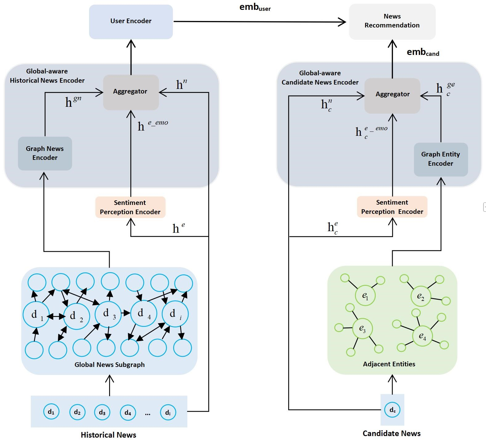

# SentiEntityRec: Entity-level Sentiment Perception Graph Neural Network for News Recommendation
Code for our paper [SentiEntityRec: Entity-level Sentiment Perception Graph Neural Network for News Recommendation](https://) published at Journal of King Saud University Computer and Information Sciences 2025. 

<p align="center">
  
  <br>
  SentiEntityRec Model Illustration
</p>

### Data preprocess
# It is necessary to pre-extract the sentiment polarity of the entities in the news in the news dataset to facilitate the subsequent model training
# The codes for entity extraction and emotional model extraction are in the "EntitySentimentVectorExtraction.py" file under folder "EntityExtraction-SentimentAnalysis"

### Environment
> Python 3.8.10
> pytorch 1.13.1+cu117
```shell
cd SentiEntityRec

apt install unzip python3.8-venv python3-pip
python3 -m venv venv
source venv/bin/activate
pip install -r requirements.txt
```

```shell
# dataset download
bash scripts/data_download.sh

# Run
python3 src/main.py model=SentiEntityRec dataset=MINDsmall reprocess=True
```

### Bibliography

```shell
@misc{wang2025sentientityrec,
      title={SentiEntityRec: Entity-level Sentiment Perception Graph Neural Network for News Recommendation}, 
      author={Qingshuai Wang and Jiahao Wang and Noor Farizah Ibrahim},
      year={2025},
      publisher ={Springer},
}
```


